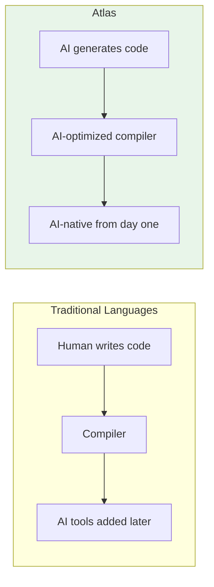

# Atlas

### The AI-First Systems Language

**Designed for AI code generation. Built entirely by AI. Built to go systems-level.**

[\](docs/README.md)

---

## Why Atlas?

**Other programming languages were built before AI existed.** They're being retrofitted with AI tooling as an afterthought.

**Atlas is different.** Every design decision asks: *"What's best for AI?"*

**The result:** A language that AI agents can generate, analyze, and debug with unprecedented reliability — and one that is being built to scale all the way to systems programming.

### The Long Game

Atlas starts where other languages wish they'd started: with AI as a first-class consumer of the language, and a memory model designed for systems-level work from day one.

- **No garbage collector.** Deterministic allocation. Value semantics by default.
- **No hidden ownership rules.** Ownership is explicit in syntax — AI can read it, write it, verify it.
- **No retrofit.** The foundation is correct before the features are built. Unlike Go (chose GC early, never went systems), unlike Swift (retrofitting ownership into ARC), Atlas gets the memory model right in v0.3 while it's still young.